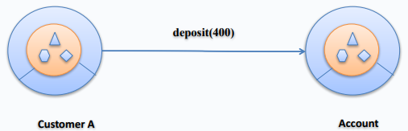
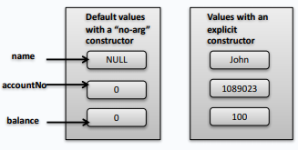
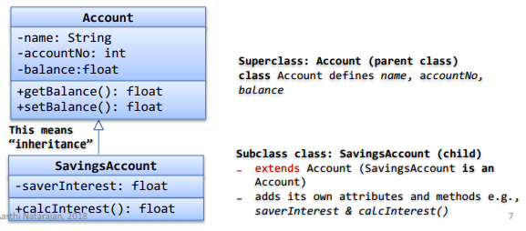

# Introduction to Java Platform

## The Java Platform

- Java:
  - simple
  - multi-threaded
  - platform-independent
  - memory management
  - secure
  - distributed
  - object-oriented

Java code (.java) --> java compiler --> Java byte code (.class)

## Java Language Basics

How to create a simple Java `class`
Structure of a Java `class`
Look at the `main` method
Creating primitive variables
Use control-loop structures `if-else`, `switch`
Iterate with loops
Create arrays
How to create comments
Working with Strings

Use `package` and `import` statements

Create Java classes, object instances, constructors, methods

## Thinking Objects

### Classes & objects

#### What are objects?

- Objects are real-world entities:
  - Something tangible adn visible e.g. car, phone, apple, pet or
  - Something intangible (you can't touch) e.g. account, time
- Objects have _state_ (characteristics or _attributes_) and _behaviour_ (_methods_ - what the object can do) e.g.
  - a car has _state_ (colour, model, speed, fuel etc.) and _behaviour_ (start, change gear, brake, refuel)
  - a dog has _state_ (colour, breed, age, gender) and _behaviour_ (bark, eat, run)
- Each object encapsulates some state (the currently assigned values for its attributes)

#### Object Oriented Design

- Identify your domain
- Identify objects


#### Object collaboration

- Objects interact and communicate by sending _messages_ to each other
- If _object_ A wants object B to perform one of its methods, it sends a message to B requesting that behaviour


- This message is typically made of three parts:
  - The _object_ to whom the message is addressed (e.g. John's 'Account' object)
  - The _method_ you want to invoke on the object (e.g. deposit())
  - Any additional information needed (e.g. amount to be deposited)



#### Objects and classes

- Many objects are of the same 'kind' but have different identity e.g. **there are many Account objects belonging to different customers, but they all share the same attributes and methods**
- 'Logically group' objects that share some common properties and behviour into a _class_ (a blueprint for this logical group of objects)


- Defining a class, does not actually create an object
- An object is _instantiated_ from a class adn the object is said to be an _instance_ of the class
  - An _object instance_ is a specific realisation of the class
- Two object instances from the same class share the same attributes and methods, but have thier own _object identity_ and are independent of each other
  - An object has state but a class doesn't
  - Two object instances from the same class share the same attributes and methods, but have their own _object identity_ and are independent of each other

#### Creating object instances

- A class is sometimes referred to as an _object's type_
- An _object instance_ iis a specific realisation of the class
- Create an instance of the Account class as follows

```java
public class Account {
    int accountNo;
    int bsb;
    float balance;

    public static void main(String[] args) {
        Account a1 = new Account();
        Account a2 = new Account();
    }
}
```


#### Constructor and instance variables

- A special method that creates an object instance and assigns values (_initialisation_) to the attributes (_instance variables_)
- Constructors eliminate default values
- When you create a class without a constructor, Python automatically creates a deafult 'no-arg' constructor for you

```java
public class Account {
    // instance variables
    String name;
    int accountNo;
    float balance;

    // constructor
    public Account(String aName, int acctNo, float bal) {
        this.name = aName;
        this.accountNo = acctNo;
        this.balance = bal;
    }

    public static void main(String[] args) {
        Account a1 = new Account("John", 1089023, 250);
    }
}
```



#### Instance methods

- Similar to instance variables, methods defined inside a class are known as _instance methods_
- Methods define what an object can do (behaviour)

```java
public class Account {
    // instance variables
    String name;
    int accountNo;
    float balance;

    // instance method
    public void deposit(float amt) {
        this.balance += amt;
    }

    // constructor
    public Account(String aName, int acctNo, float bal) {
        this.name = aName;
        this.accountNo = acctNo;
        this.balance = bal;
    }

    public static void main(String[] args) {
        Account a1 = new Account("John", 1089023, 250);
    }
}
```

#### Object references


#### What is UML?

- UML stands for Unified Modelling Language (<http://www.uml.org/>)
- Programming languages not abstract enough for OO design
- An open source, graphical language to model software solutions, application structures, system behaviour and business processes
- Several uses:
  - As a design that communicates aspects of your system
  - As a software blueprint
  - Sometimes, used for auto code-generation

#### UML Diagram Types


#### Representing classes in UML


### Abstraction

- Helps you to focus on the common properties and behaviours of objects
- Good abstraction help us to accurately represent the knowledge we gather about the problem domain (discard anything unimportant or irrelevant)
- What comes to your mind when we think of a 'car'?
  - Do you create a class for each brand (BMW, Audi, Lambo)?
  - Write one class called Car and abstract
    - Focus on the common essential qualities of the object
    - Focus on the application domain
  - What if a specific brand had a special proerty or behaviour? (later on _inheritance_)

### Encapsulation

- An OO design concept that emphasises hiding the implementation
- When you drive a car, do you ever worry how a steering wheel makes a right turn or a left turn?
- You are only concerned with the function of the steering wheel
- Encapsulation leads to abstraction

#### Encapsulating object state

- Encapsulation of object state implies _hiding_ the object's attributes
- An object's attributes represents its individual characteristics or properties, so access to the object's data must be restricted
  - _Methods_ provide explicit access to the object
  - e.g. use of getter and setter methods to access or modify the fields


#### Why is encapsulation important?

1. Encapsulation ensures that an object's state is in a _consistent state_
2. Encapsulation increases _usability_
   - Keeping the data private and exposing the object only through its interface (public methods) provides a clear view of the role of the object and increases usability
   - Clear contract between the invoker and the provider, where the client agrees to invoke an object's mehod adhering to the method signature and provider guarantees consistent behaviour of the method invoked (if the client invoked the method correctly)
3. Encapsulation _abstracts_ the implementation, _reduces the dependencies_ so that a change to a class does not cause a rippling effect on the system

### Inheritance

Relationships (1)

- So far, we have logically grouped objects with common characteristics into a class, but what if these objects had some special features?
  - e.g. if we wanted to store that sports car has spoilers
- Inheritance - models a relationship between classes in which one class represents a more general concept (_parent or base class_) and another a more specialised class (_sub-class_)
- Inheriatance models a "is-a" type of relationship e.g.
  - a dog is-a type of pet
  - a maanager is-a type of employee
  - a rectangle is-a type of 2D shape
- To implement inheritance, we
  - Create a new class (_sub-class_), that inherits common properties and behaviour from a _base class_ (parent-class or super-class)
    - We say the child class _inherits/is-derived from_ the parent class
  - Sub-class can _extend_ the parent class by defining additional properties and behaviour specific to the inherited group of objects
  - Sub-class can _override_ methods in the parent class with their own specialised behaviour



