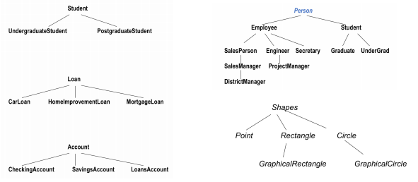
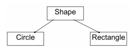
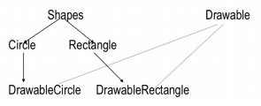
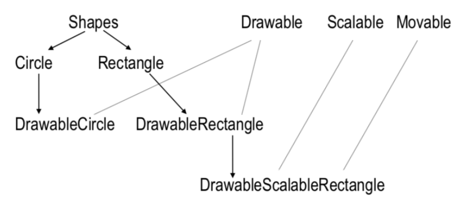
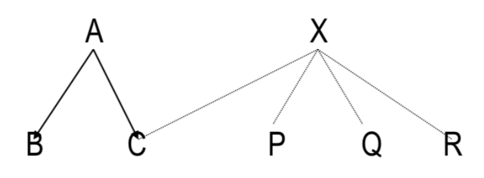
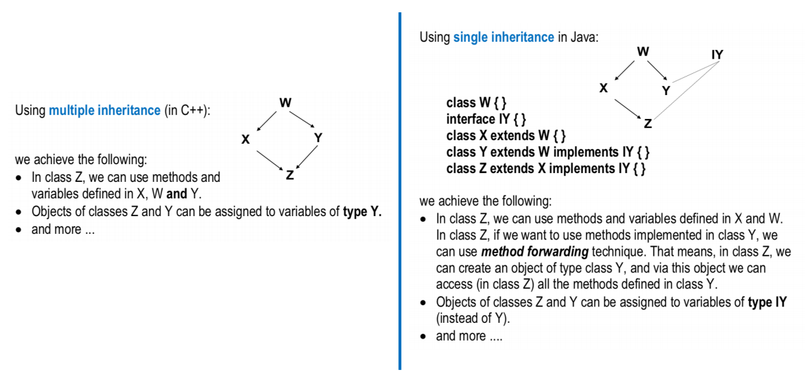

# Object Oriented Programming (OOP) in Java

## Object Oriented Programming (OOP)

- In procedural programming languages (like C), programming tends to be **action-oriented**, whereas in Java - programming is **object-oriented**

- In _procedural_ programming,

  - Groups of actions that perform some task are formed into functions and functions are grouped to form programs

- In OOP,
  - Programmers concentrate on creating their own user-defined types called _classes_
  - Each _class_ contains _data_ as well as the set of _methods_ (procedures) that manipulate the data
  - An instance of a user-defined type (i.e. a _class_) is called an _object_
  - OOP _encapsulates_ data (attributes) and methods (behaviours) into _objects_, the data and methds of an object are intimately tied together
  - Objects have the property of _information hiding_

## Inheritance in OOP

- _Inheritance_ is a form of software reusability in which new classes are created from the existing classes by absorbing their attributes and behaviours
- Instead of defining completely (separate) new class, the programmer can designate that the new class is to inherit attributes and behaviours of the existing class (called _superclass_)
  - The new class is referred to as _subclass_
- Programmer can _add more attributes and behaviours_ to the subclass, hence, normally _subclasses_ have **more features** than their _superclasses_
- Inheritance relationships form \_\_tree-like hierarchical structures. For example,
  

### 'Is-a' - Inheritance relationship

- In a 'is-a' relationship, an object of a subclass may also be treated as an object of the superclass
- For example, _UndergraduateStudent_ can be treated as _Student_ too
- You should use inheritance to model 'is-a' relationship

**VERY IMPORTANT**

- Don't use inheritance unless all or most inherited attributes and methods makes sense
- For example, mathematically, a _circle_ is-a oval, however, you should NOT inherit a class _circle_ from a class _oval_. A class _oval_ can have one method to set _width_ and another to set _height_.

### 'Has-a' - Association relationship

- In a 'has-a' relationship, a **class object has an object of another class** to store its state or do its work, i.e. it 'has-a' reference to that other object
- For example, a Retangle is-not-a Line. However, we may use a Line to draw a Rectangle.
- The 'has-a' relationship is quite different from an 'is-a' relationship
- 'Has-a' relationships are examples of creating new classes by _composition_ of existing classes (as opposed to extending classes)

**VERY IMPORTANT**

- Getting 'is-a' vs 'has-a' relationships correct is both _subtle_ and potentially _critical_. You should _consider_ all _possible_ future _usages_ of the classes before finalising the hierarchy
- It is possible that _obvious solutions may not work_ for some applications.

### Designing a Class

- Think carefully about the functionality (methods) a class should offer
- Always _try to keep data private_ (local)
- Consider _different ways_ an object may be created
- Creating an object may require different actions such as initialisations
- Always initialise data
- If the object is no longer in use, free up all the associated resources
- _Break up_ classes with _too many responsibilities_
- In Object Oriented, classes are often closely related. '_Factor out_' common attributes and behaviours and place these in a class. Then use suitable relationships between classes (e.g. 'is-a' or 'has-a')

## Introduction to Classes and Objects

- A class is a collection of _data_ and _methods_ (procedures) that operate on that data
- For example, a circle can be described by the x,y position of its centre and by its radius
- We can define some udeful methods (procedures) for circles, compute circumference, compute area, check whether points are inside the circle etc.
- By defining the Circle class (as below), we can create a _new data type_

### The class Circle

For simplicity, the methods for getter and setters are not shown in the code

```java
public class Circle {
    protected static final double pi= 3.14159;
    protected int x, y;
    protected int r;

    // Very simple constructor
    public Circle() {
        this.x = 1;
        this.y = 1;
        this.r = 1;
    }

    // Another simple constructor
    public Circle(int x, int y, int r) {
        this.x = x;
        this.y = y;
        this.r = r;
    }

    /**
    * Below, methods that return the circumference or
    * area of the circle
    */
    public double circumference() {
        return 2 * pi * r;
    }

    public double area() {
        return pi * r * r;
    }
}

```

### Objects are Instances of a class

In Java, objects are created by instantiating a class. For example,

```java
Circle c;
c = new Circle();
```

or

```java
Circle c = new Circle();
```

### Accessing Object Data

We can access data fields of an object. For example,

```java
Circle c = new Circle();
// Initialise our circle to have centre (2, 5) and radius 1
// Assume x, y, r are not private
c.x = 2;
c.y = 5;
c.r = 1;
```

### Using Object Methods

To access the methods of an object, we can use the same syntax as accessing the data of an object:

```java
Circle c = new Circle();
double a;
c.r = 2; // assuming r is not private
a = c.area();
```

## Subclasses and Inheritance

### First Approach

- In this approach we are creating the _new separate class_ for _GraphicalCircle_ and **rewriting** the code already available in the class _Circle_
- For example, we rewrite the methods _area_ and _circumference_
- Hence, this approach is NOT elegant, in fact its the _worst_ possible solution

```java
// The class of graphical circles
public class GraphicalCircle {
    int x, y;
    int r;
    Color outline, fill;

    public double circumference() {
        return 2 * 3.14159 * r;
    }

    public double area() {
        return 3.14159 * r * r;
    }

    public void draw(Graphics g) {
        g.setColor(outline);
        g.drawOval(x-r, y-r, 2*r, 2*r);
        g.setColor(fill);
        g.fillOval(x-r, y-r, 2*r, 2*r);
    }
}
```

### Second Approach

- We want to implement _GraphicalCircle_ so that it can make use of the code in the class _Circle_
- This approach uses 'has-a' relationship
- That means, a _GraphicalCircle_ has a (mathematical) _Circle_
- It uses methods from the class _Circle_ (_area_ and _circumference_) to define some of the new methods
- This technique is also known as _method forwarding_

```java
public class GraphicalCircle2 {
    // here's the math circle
    Circle c;
    // the new graphics variables go here
    Color outline, fill;

    // very simple constructor
    public GraphicalCircle2 {
        c = new Circle();
        this.outline = Color.black;
        this.fill = Color.white;
    }

    // another simple constructor
    public GraphicalCircle2(int x, int y, int r, Color o, Color f) {
        c = new Circle(x, y, r);
        this.outline = o;
        this.fill = f;
    }

    // draw method, using object 'c'
    public void draw(Graphics g) {
        g.setColor(outline);
        g.drawOval(c.x - c.r, e.y - c.r, 2 * c.r, 2 * c.r);
        g.setColor(fill);
        g.fillOval(c.x - c.r, e.y - c.r, 2 * c.r, 2 * c.r);
    }
}
```

### Third Approach - Extending a Class

- We can say that _GraphicalCircle_ is-a _Circle_
- Hence we can define _GraphicalCircle_ as an extension, or subclass of _Circle_
- The subclass _GraphicalCircle_ inherits all the variables and methods of its superclass _Circle_

```java
import java.awt.Color;
import java.awt.Graphics;

public class GraphicalCircle extends Circle {

    Color outline, fill;

    public GraphicalCircle {
        super();
        this.outline = Color.black;
        this.fill = Color.white;
    }

    // another simple constructor
    public GraphicalCircle2(int x, int y, int r, Color o, Color f) {
        super(x, y, r);
        this.outline = o;
        this.fill = f;
    }

    public void draw(Graphics g) {
        g.setColor(outline);
        g.drawOval(x-r, y-r, 2*r, 2*r);
        g.setColor(fill);
        g.fillOval(x-r, y-r, 2*r, 2*r);
    }
```

### Example

We can assign an instance of _GraphicalCircle_ to a _Circle_ variable. For example,

```java
GraphicalCircle gc = new GraphicalCircle();
double area = gc.area();
Circle c = gc;
// we cannot call draw method for c
```

**IMPORTANT**
Considering the variable 'c' is of type _Circle_, we can only access attributes and methods available in class _Circle_

### Superclasses, Objects, and the class Hierarchy

- Every class has a superclass
- If we don't define the superclass, by default, the superclass is the class _Object_

_Object_ class:

- It's the only class that does not have a superclass
- The methods defined by _Object_ can be called by any Java object (instance)
- Often we need to override teh following methods:
  - toString()
  - equals()
  - hasCode()

## Abstract Classes

Using _abstract_ classes

- We can declare classes that define only part of an implementation
- Leaving extended classes to provide specific implementation of some or all the methods

The benefit of an abstract class:

- Methods may be declared such that the programmer knows the _interface definition_ of an object
- However, methods can be implemented differently in different subclasses of the abstract class

Some rules about abstract classes

- An abstract class is a class that is **declared abstract**
- If a class _includes abstract methods_, then the class itself must be declared abstract
- An abstract class _cannot be instantiated_
- A subclass of an abstract class can be instantiated if it overrides each of the abstract methods of its superclass and provides _an implementation_ for all of them
- If a subclass of an abstract class _does not implement_ all the abstract methods it inherits, that subclass itself is abstract

### Example



```java
public abstract class Shape {
    public abstract double area();
    public abstract double circumference();
}
```

```java
public class Circle extends Shape {
    protected static final double pi= 3.14159;
    protected int x, y;
    protected int r;

    // Very simple constructor
    public Circle() {
        this.x = 1;
        this.y = 1;
        this.r = 1;
    }

    // Another simple constructor
    public Circle(int x, int y, int r) {
        this.x = x;
        this.y = y;
        this.r = r;
    }

    /**
    * Below, methods that return the circumference or
    * area of the circle
    */
    public double circumference() {
        return 2 * pi * r;
    }

    public double area() {
        return pi * r * r;
    }
}
```

```java
public class Rectangle extends Shape {
    protected double width, height;
    public Rectangle() {
        width = 1.0;
        height = 1.0;
    }

    public Rectangle(double w, double h) {
        this.width = w;
        this.height = h;
    }

    public double area() {
        return width * height;
    }

    public double circumference() {
        return 2 * (width + height);
    }
}
```

Some things to note:

- As _Shape_ is an abstract clas, we cannot instantiate it
- Instantiations of _Circle_ and _Rectangle_ can be assigned to variables of _Shape_. No cast is necessary
- In other words, subclasses of _Shape_ can be assigned to elements of an array of _Shape_. No cast is necessary
- We can invoke area() and circumference() methods for _Shape_ objects

## Single Inheritance vs Multiple Inheritance

- In Java, a new class can extend exactly one superclass - a model known as _single inheritance_
- Some object-oriented languages employ _multiple inheritance_, where a new class can have two or more _superclasses_
- In multiple inheritance, problems arise when a superclass' behaviour is _inherited_ in two/multiple ways
- Single inheritance precludes some useful and correct designs
- In Java, _interface_ in the class hierarchu can be used to add multiple inheritance

## Interfaces

- Interfaces are like abstract classes, but with a few important differences
- All the methods defined within an interface are _implicitly abstract_ (We don't need to use `abstract` keyword, however, to improve clarity, one can use the keyword)
- _Variables_ declared in an interface must be _static_ and _final_, that means, they must be _constants_
- Just like a class _extends_ its superclass, it can also optionally _implement_ an interface
- In order to implement an interface, a class must first declare the interface in an _implements_ clause, and then it must provide an implementation for all of the abstract methods of the interface
- A class can 'implement' more than one interfaces

### Example



```java
public interface Drawable {
    public void setColor(Color c);
    public void setPosition(double x, double y);
    public void draw(Graphics g);
}

public class DrawableRectangle extends Rectangle implements Drawable{
    private Color c;
    private double x, y;

    public void setColor(Color c) {
        this.c = c;
    }

    public void setPosition(double x, double y) {
        this.x = x;
        this.y = y;
    }

    public void draw(Graphics g) {
        g.drawRect(x, y, w, h, c);
    }
}
```

- When a class _implements_ an interface, instance of that class can also be _assigned to_ variabbles of the _interface type_

```java
Shape[] shapes = new Shape[3];
Drawable[] drawables = new Drawable[3];

DrawableCircle dc = new DrawableCircle(1.1);
DrawableSquare ds = new DrawableSquare(2.5);
DrawableRectangle dr = new DrawableRectangle(2.3, 4.5);

// The shapes can be assigned to both arrays
shapes[0] = dc; drawables[0] = dc;
shapes[1] = ds; drawables[1] = ds;
shapes[2] = dr; drawables[2] = dr;

// We can invoke abstract methods in Drawable and Shape
double total_area = 0;
for (int i = 0; i < shapes.length; i++) {
    total_area += shapes[i].area();

    drawables[i].setPosition(i * 10.0, i * 10.0);

    // assume that graphic area 'g' is defined somewhere
    drawables[i].draw(g);
}
```

### Implementing Multiple Interfaces

A class can _implement_ more than one interface. For example,


```java
public class DrawableScalableRectangle extends DrawableRectangle implements Movable, Scalable {
    // TODO: methods
}
```

### Extending Interfaces

- Interfaces can have _sub-interfaces_, just like classes can have subclasses
- A sub-interface **inherits all** the abstract methods and constants of its super-interface, and may define new abstract methods and constants
- Interfaces _can extend_ more than one interface at a time. For example,

```java
public interface Transformable extends Scalable, Rotable, Reflectable{}

public interface DrawingObject extends Drawable, Transformable{}

public class Shape implements DrawingObject {}
```

## Method Forwarding (Has-a Relationship)



- Suppose class C extends class A, and also implements interface X
- As all the methods defined in interface X are abstract, class C needs to implement all these methods
- However, there are three implementations of X (in P, Q, R)
- In class C, we may want to use one of these implementations, that means, we may want to use some or all methods implemented in P, Q or R
- Say we want to use methods implemented in P. We can do this by creating an object of type class P in class C, and through this object access all the methods implemented in P
- Note that, in class C, we do need to provide required stubs for all the methods in the interface X. In the body of the methods we may simply call methods of class P via the object of class P
- This approach is also known as **method forwarding**

## Method Overriding (Polymorphism)

- When a class defines a method using the same name, return type, and by the number, type, and position of its arguments as a method in its _superclass_, the method in the class **overrides** the method in the _superclass_
- If a method is invoked for an object of the class, it's the _new definition_ og the method that is called, and NOT the superclass' old definition

**POLYMORPHISM**
An object's ability to decide what method to apply to itself, depending on where it is in the inheritance hierarchy, is usually called polymorphism

### Example

In the example below

- If `p` is an instance of class `B`, `p.f()` refers to `f()` in class `B`
- However, if `p` is an instance of class `A`, `p.f()` refers to `f()` in class `A`
  The example also shows how to refer to the overridden method using `super` keyword

```java
class A {
    int i = 1;
    int f() {
        return i;
    }
}

class B extends A {
    int i;                      // shadows i from A
    int f() {                   // overrides f() from A
        i = super.i + 1;        // retrieves i from A
        return super.f() + 1;   // invokes f() from A
    }
}
```

- Suppose class C is a subclass of class B, and class B is a subclass of class A
- Class A and class C both define method `f()`
- From class C, we can refer to the overridden method by, `super.f()`
  - This is because class B inherits method `f()` from class A
- However,
  - If _all three classes_ define `f()`, then calling `super.f()` in class C invokes class B's definition of the method
  - Importantly, in this case, there is _no way_ to invoke `A.f()` from within class C

## Method Overloading

Defining methods with the _same name_ and _different_ argument or return types is called **method overloading**

In Java,

- A method is distinguished by its method signature - its name, return type, and by the number, type, and postiion of its arguments

For example,

```java
double add(int, int)
double add(int, double)
double add(float, int)
double add(int, int, int)
double add(int, double, int)
```

### Data Hiding and Encapsulation

- We can _hide the data_ within the class and make it available only through the methods
- This can help in maintaining the consistency of the data for an object, that means the state of an object
  **Visibility Modifiers**
- Java provides five access modifiers (for variables/methods/classes),
  - public - visible to the world
  - private - visible to the class only
  - protected - visible to the package and all subclasses
  - No modifier (default) - visible to the package

## Constructors

- Good practice to _define_ the required constructors for _all_ classes
- If a constructor is _not defined_ in a class,
  - _no-argument_ constructor is _implicitly inserted_
  - this no-argument constructor invokes the _superclass’s no-argument_ constructor
  - if the parent class (superclass) doesn’t have a visible constructor with no-argument, it results in a compilation _error_
- If the _first statement_ in a constructor is not a call to `super()` or `this()`, a call to `super()` is _implicitly_ inserted
- If a constructor is _defined_ with _one or more arguments_, _no-argument_ constructor is _not inserted_ in that class
- A class can have _multiple constructors_, with different signatures
- The word `this` can be used to call another constructor in the same class

### Diamond Inheritance Problem: A Possible Solution


