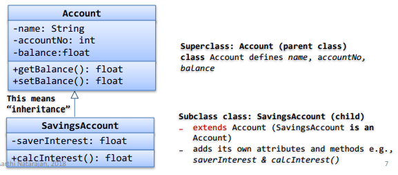
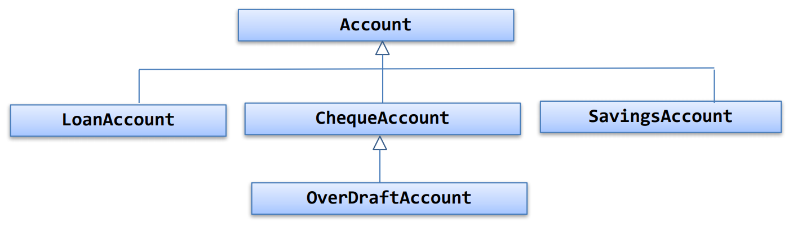
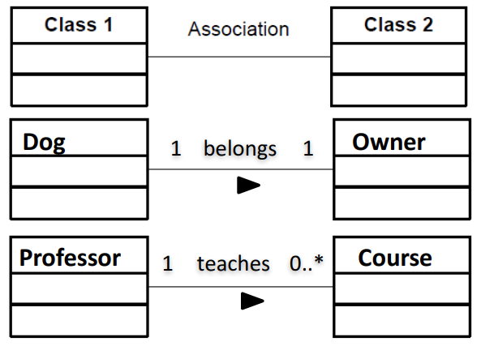
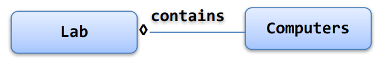
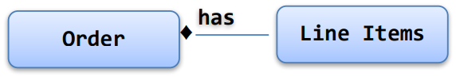
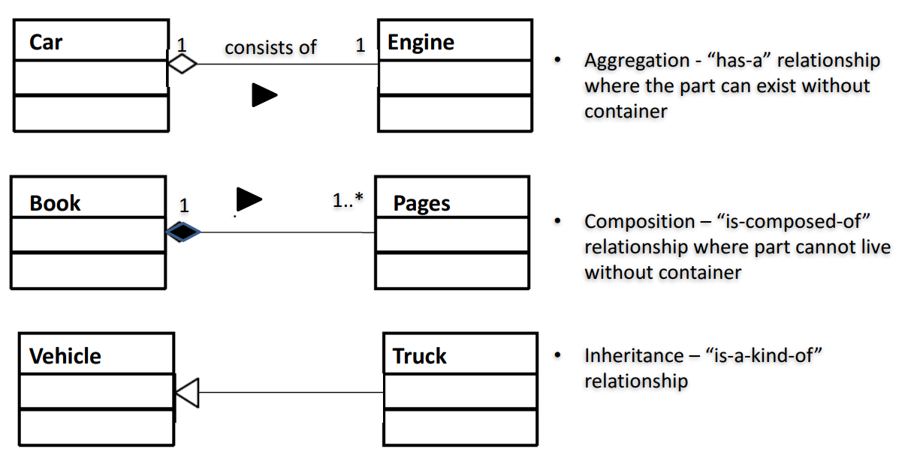
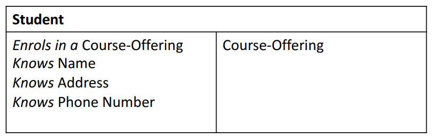

# Object Oriented Design and Programming

- UML (see week-1/intro-to-java-platform.md)

## Using super in subclass

- To invoke a parent's method or to access a (non-private) field in the parent class, use `super`
  - e.g. `class SavingsAccount` can invoke fields and methods in parent `class Account` as:
    - ```java
      super.account()
      super.getBalance()
      ```
    - 
- The invoked method does not have to be defined in the immediate parent class, but could be inherited from some class further in the inheritance hierarchy
- To invoke the constructor in the parent's class use `super()`

## Constructors are not inherited

- A sub-class **does not inherit constructors**
- To create an instance of a subclass, there are two options:

  1. Use the _default 'no-arg'_ constructor

     - This default constructor will make a _default_ call to `super()`, which is the constructor in the parent classes

  2. Define a constructor in the subclass
     - Then, a default constructor is no longer provided
     - use `super()` to invoke the parent constructor
       - e.g. `SavingsAccount` calls the constructor of the `Account` as `super(bsb, accountNo, salary)`
     - Call to `super()` must be the first statement of the constructor. If this call is not made, default call to `super()` is inserted

## Overriding methods

- A subclass can _override_ methods in the parent class with its own specialised behaviour
  - `class Rectangle` overrides method `getArea()` in parent `class Shape` to provide its own specific implementations

```java
public class Shape {
    public String color;
    public Shape(String color) {
        this.color = color;
    }
    /**
     * @return Returns the area fo the shape
    */
    public float getArea() {
        return 0;
    }
}
```

```java
public class Rectangle extends Shape {
    public int height;
    public int width;
    public Rectangle(String color) {
        super(color);
    }
    @Override
    public float getArea() {
        return this.height * this.width;
    }
}
```

- Method name and order of arguments of a child method must match the signature of the corresponding method in parent class
- Overridden method cannot be less accessible

## Single Inheritance

- The Java language allows a class to extend only one other class - single inheritance
- Multiple inheritance allows you to inherit from more than one super class
  - Supported by languages such as C++ and Python



## Understanding object types

- All object references have a _type_
- An object, which is an instance of a class has a type, but is also an instance of its parent class e.g.
  - A subclass **C** has all the members of its parent class **P**
    ```java
    Rectangel aRect = new Rectangle();
    // But aRect is also an instance of class Shape
    ```
- Hence wherever there's an object of class **C**, it can be referenced as an object of class **P**
  ```java
  Shape aRect = new Rectangle();
  Account myAccount = new SavingsAccount();
  ```
- Java gives you the ability to refer to an object using its actual form or parent form

## Polymorphism

- _Polymorphism_ means 'many forms': an important OO principle that supports software reuse and maintenance
- The variable `s1` is said to be _polymorphic_ as it can refer to objects of different forms
  ```java
  Shape s1 = new Rectangle();
  s1 = new Circle();
  ```
  - These assignments are legal as `Rectangle` and `Circle` are both types of `Shape`
- However, the following does not compile: `s1.getHeight();`

  - Using the variable `s1`, you can only access parts of the object that belong to the `class Shape`; the `Rectangle` specific components are hidden
  - The Java compiler recognises that `s1` is a `Shape` NOT a `Rectangle`

- The function `getArea()` defined in class `Shape` and `Rectangle` is said to be _polymorphic_ as the function can be applied on objects of different classes to achieve the same semantic result e.g.
  ```java
  Shape s1 = new Shape();
  Rectangle r1 = new Rectangle();
  ```
  - Calling methods `s1.getArea()` and `r1.getArea()` invokes different behaviour but achieve the semantic result

### Dynamic binding with Polymorphism

- But what happens here? `Shape s1 = Rectangle();`
- A variable is _polymorphic_, but an **object instance** has only _one type_ (form), defined when it is instantiated
- Here _dynamic binding_ or _Virtual Method Invocation_ ensures that when a method is invoked, you get the behaviour associated with the object to which the variable refers to at runtime
- The behaviour is not determined by the compile time type of the variable

## The `instanceOf` operator

- As objects can be referenced using their parent classes, it is sometimes necessary to know what is the actual type of the object at runtime
- Use the `instanceOf` operator
  ```java
  public void getCOordinates(Shape s) {
      if (s instanceOf Rectangle) {
          // do something
      }
      else if (s instanceOf Circle) {
          // do something else
      }
  }
  ```

## Association

Relationships (2)

- Association is a special type of relationship between two classes, that shows that the two classes are:
  - linked to each other e.g. a laturer teaches a course offering
  - or combined into some kind of _'has-a'_ relationship, where one class 'contains' another class e.g. a course offering has students
- Modelled in UMLas a line between two classes
  
- Associations can further be refined as:
  - **Aggregation** relationship (hollow diamond symbol): The contained item is an element of a collection but it can also exist on its own e.g. a lecturer in a university or a student at a university
    
  - **Composition** relationship (filled diamond symbol): The contained item is an integral part of the containing item, such as a leg in a desk or engine in a car
    

### More examples of associations



## COMP1531 Recap - Requirements Engineering and Domain Modelling

### Requirements Analysis vs Domain Modelling

- Requirements analysis determines 'external behaviour'
  - What are the features of the system-to-be and who requires these features (actors)
- Domain modelling determines 'internal behaviour'
  - How elements of system-to-be interact to produce the external behaviour
- Requireemnts analysis and domain modelling are mutually dependent - domain modelling supports clarification of requirements, whereas requirements help building up the model

### Domain model

- Also referred to as a _conceptual model_ or _domain object model_
- Provides a visual representation of the problem domain, through decomposing the domain into key concepts or objects in the real-world and identifying the relationships between these objects
- Techniques to build a domain model
  - Noun/verb analysis
  - CRC Cards

#### Noun/verb phrase analysis

- Analyze textual description of the domain to identify noun phrases
- Caveats: Textual descriptions in natural languages are ambiguous (different nouns can refer to the same thing and the same noun can mean multiple things)
- Consider this text about an ATM machine:
  - A **customer** arrives at an **ATM machine** to withdraw money. The customer enters the **card** into the ATM machine. Customer enters **PIN**. The ATM verifies whether the customer's card number and PIN are correct. Customer withdraws money from the **account**. The ATM machine records and updates the transaction.
  - Candidate conceptual classes: ATM, Customer, Account, Card

#### Using CRC cards

- CRC stands for:
  - _Class_: Represents a collection of similar objects
  - _Responsibility_: Something that the class **knows** or **does**
  - _Collaborator_: Another class that a class must interact with ot fulfil its responsibilities
- Written in 4 x 6 index cards, an individual CRC card is used to represent a domain object.
- Featured prominently as a design technique in XP programming
  

## Case study

A Domain Model for an Enrolment System

### Enrolment System

- Students enrol in courses that are offered in particular semesters
- Students receive grades (pass, fail etc.) for courses in particular semesters
- Course may have prerequisites (other courses) and must have credit point values
- Course offerings are broken down into multiple sessions (lectures, tutorials and labs)
- Sessions in a course offering for a particular semester have an allocated room and timeslot
- If a student enrols in a course, they must also enrol in some sessions of that course

### Use Case (UC1): Enrol a student in a course

Flow of events for usage success scenario:

1. **Student** requests **EnrolSys** to _display list of courses_ for the current **semester**
2. Student selects a **course**
3. Student request EnrolSys to _enrol_ in the course
4. EnrolSys _check_ if student meets **prerequisites course** (satisfied)
5. EnrolSys checks available **sessions** (lectures, tutorials and labs)
6. EnrolSys **creates** an **Enrolment** and provides details to the Student

### Use Case: Enrol student in a course

Flow of events for usage success scenario

1. System shows list of courses
2. User selects a course
3. User asks syste to enrol in a course
4. System checks prerequisites of course (satisfied)
5. System allocates sessions to the user
6. System displays enrolment details to user

### Walkthrough

1. EnrolSys displays list of Courses (CourseOffering)
2. User requests EnrolSys to enrol in a particular **CourseOffering**
3. EnrolSys asks **Course** for the relevant prerequisites
4. EnrolSys checks if Student passes prereq (satisfied)
5. EnrolSys allocates **Session** to the Student
6. EnrolSys creates an **Enrolment** and provides **Enrolment** details to the Student

## UML Class Diagram

- Assoication
- Aggregations
- Composition
- Inheritance (`extends`)
- Realisation (implements an interface - coming up)

[UML Sequence Diagram](https://developer.ibm.com/articles/the-sequence-diagram/)
